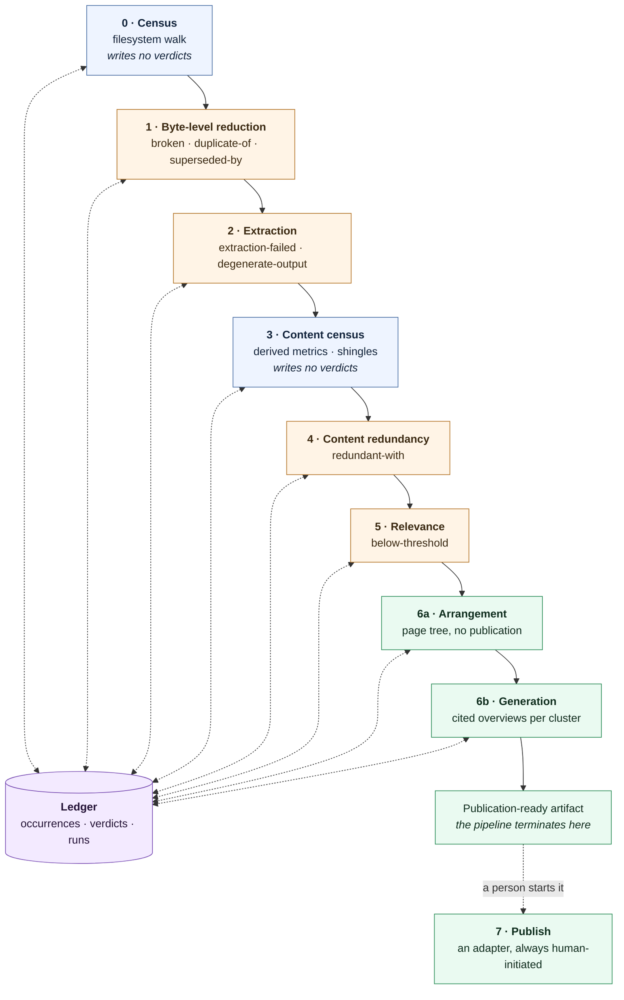
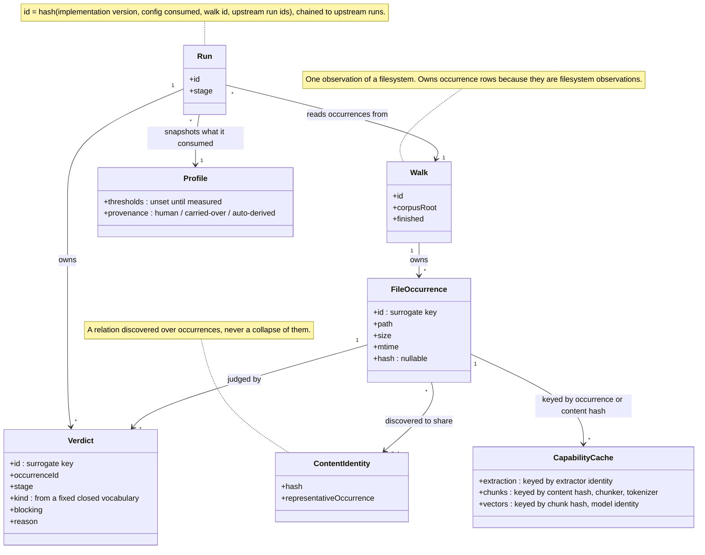
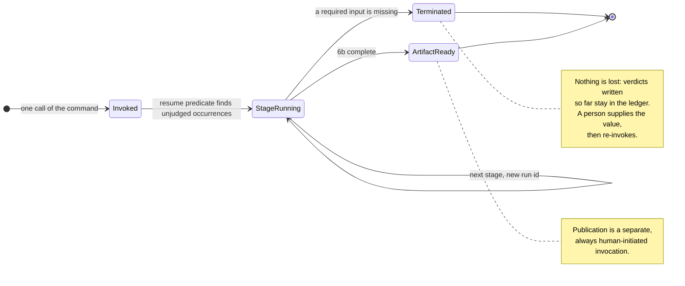
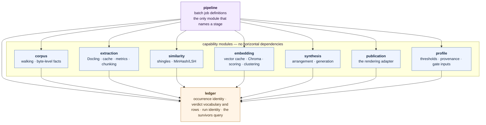
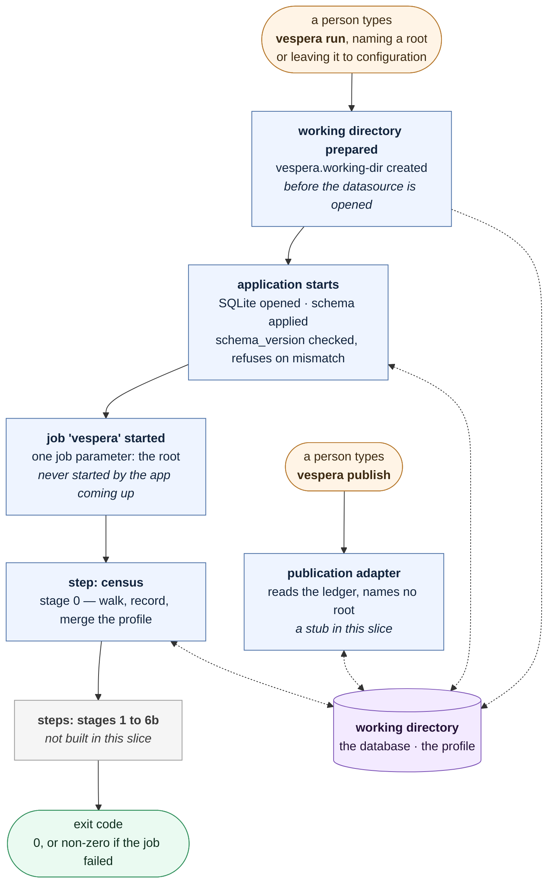

# Vespera — Architecture & Tech Stack

**Project:** Document Curation Pipeline → Knowledge Base
**Source:** compiled 2026-08-21 from the ADRs and `CONTEXT.md`. Demoted from a hand-off note to this repo's standing architecture document on 2026-08-22, when the lost ADR text was reconstituted from the condensed ledger into [`docs/adr/`](./adr/README.md).
**Reading order:** §1 and §2 describe the system and are the fuller record — most ADR files carry only a one-line summary and point back here. The condensed ledger now lives in [`docs/decision-ledger.md`](./decision-ledger.md), kept as the provenance witness for those files rather than as the place to read a decision.
**Status:** design phase; no domain code has been written against this architecture yet. Open questions are not tracked here — they live on the wayfinder map, [Census slice: the way to a hand-off spec](https://github.com/algernon28/vespera/issues/1).

---

## 1. Architecture

### 1.1 What it does

Vespera curates an unknown, multi-format local document archive (hundreds of GB of `.txt`, `.docx`, `.pdf`, images) into a publication-ready knowledge base. It **measures the corpus before judging it** (ADR-006), removes what is mechanically broken, redundant, or topically irrelevant (ADR-007/ADR-004), and synthesises connective material over what survives (ADR-021). The engine is **domain-agnostic**: it carries no built-in knowledge of the corpus's subject matter, and the operator supplies domain knowledge only through a seed folder of known-relevant documents (ADR-003, ADR-004).

### 1.2 The cascade (ADR-017)

Eight stages, each defined by the verdicts it writes. Stages never call each other — every stage reads and writes only through the ledger (ADR-036, ADR-042):

| #  | Stage                        | Writes                                    | Notes                                                                                                 |
|----|------------------------------|-------------------------------------------|-------------------------------------------------------------------------------------------------------|
| 0  | Census                       | *(no verdicts)*                           | Filesystem walk → file occurrence rows. Pure measurement (ADR-006).                                   |
| 1  | Byte-level reduction         | `broken`, `duplicate-of`, `superseded-by` | Cheapest discriminating filter, runs first.                                                           |
| 2  | Extraction                   | `extraction-failed`, `degenerate-output`  | Docling, out-of-process, cached; silent about text fidelity, never about failure (ADR-010, ADR-070).  |
| 3  | Content census               | *(no verdicts)*                           | Derived metrics as columns written during extraction (ADR-019); shingles computed here too (ADR-038). |
| 4  | Content redundancy (lexical) | `redundant-with`                          | MinHash + LSH banding over shingles (ADR-018), boilerplate-stripped (ADR-038).                        |
| 5  | Relevance (embeddings)       | `below-threshold`                         | Scoring against the seed set (ADR-020), clustering within each seed partition (ADR-027, ADR-045).     |
| 6a | Arrangement                  | *(page tree, no publication)*             | Seed-named taxonomy + within-seed clusters (ADR-022). Human gate before 6b.                           |
| 6b | Generation                   | —                                         | One overview per cluster, citations resolved to occurrence ids (ADR-022, ADR-026).                    |
| 7  | Publish                      | —                                         | An **adapter**, not a stage — invoked separately, always human-initiated (ADR-025, ADR-035).          |

Ordering principle: the cheapest filter runs first, so every occurrence removed early is extraction or embedding never paid for (ADR-017).

**The cascade.** Every stage reads and writes only through the ledger; none of them calls another. Stage 7 sits outside the chain because it is an adapter rather than a stage.

### 1.3 Core architectural model

- **Verdict-ledger, not a moving pipeline** (ADR-014). Documents never move between stages. One table is populated once by census; every stage *appends* verdict rows. "Survivors" is a query (`survivors(runId)`, ADR-042) over occurrences carrying no blocking verdict — not a physical location. This makes retuning a threshold a `DELETE` of one stage's rows plus a re-run, leaves extraction untouched, and makes "why wasn't this published" a single query.
- **Identity is two-layered** (ADR-015, ADR-048): a **file occurrence** (surrogate key, path/size/mtime, hash nullable) is a filesystem observation; **content identity** is a discovered relation between occurrences, never a collapse of them.
- **Two independent lifetimes** (ADR-048): a **walk** (owns occurrence rows, carries corpus root + completion status) is walk-scoped because occurrences are filesystem observations; a **run** (owns verdict rows, one execution of one stage under one configuration) is run-scoped because verdicts are derived under a configuration. `run_id = hash(stage's implementation version, config consumed, walk id, upstream run ids)` — chained, so an upstream implementation change forces downstream re-runs even with identical config.
- **The pipeline never blocks** (ADR-047). It terminates when a required input (a gate) is missing, and resumes from the ledger on re-invocation. A gate is an *input the pipeline requires*, not a pause it takes (ADR-031). Iteration happens *between* runs, not inside them. Human-attended work is the *campaign* (a corpus's first several runs, with a human editing the profile in between); every individual run is unattended.
- **Every stage writes a row per occurrence, including a pass** (ADR-049) — a non-blocking `passed` verdict — so the resume predicate ("occurrences lacking a verdict for stage S in run R") can distinguish "examined, fine" from "not yet examined." Verdicts use a surrogate primary key so multiple verdicts can accumulate per occurrence/stage/run.
- **Observe before enforce.** No threshold is applied before it is measured (ADR-006). Thresholds ship `null` until a census/measurement pass informs them, and are then set by human calibration against a sampled, information-selected set (ADR-028) or explicitly marked `auto`-derived (ADR-047) if unattended.
- **The profile** (ADR-043) is the per-corpus record of every judgement the engine cannot make itself. Authored as a file (mutable, per-corpus); every run snapshots what it actually consumed into the ledger with provenance (human-calibrated / carried-over / auto-derived). File is input, ledger is history — history never overrides input. The file is written by census as a draft and by humans thereafter; nothing downstream of census writes it.
- **Relevance is one-class, exemplar-based** (ADR-004, ADR-007, ADR-020). No supplied negatives (they'd be "easy negatives" far from the boundary); hard negatives are mined from the corpus after scoring. Score = max over seed documents of (mean of top-3 chunk similarities against that seed), storing the winning seed. Needs no vector database at scoring time — a few dozen seeds fit in memory while corpus chunks stream past.
- **The seed set does triple duty** (ADR-004, ADR-020, ADR-022): it defines relevance, names the top-level publication taxonomy (one node per seed + `unattributed`), and shapes the page tree. A poorly chosen seed set produces a poorly shaped wiki, not merely a poorly tuned filter — visible via diagnostics (per-seed admission counts, cluster counts).
- **Clustering runs within each seed partition**, never corpus-wide (ADR-027, ADR-045) — cheap, embarrassingly parallel, keeps the "60%-owned-by-one-seed" alarm aligned with a genuine compute problem, and bounds Chroma's working set to one partition at a time.
- **Synthesis, not summarisation** (ADR-021). Stage 5 leaves a heap of survivors; stage 6 makes it organic. 6a arranges (page tree, zero publication); 6b generates connective overviews per cluster, gated on a human reading 6a first.
- **Publication is terminal, one-shot, and separate** (ADR-024, ADR-025, ADR-035). The pipeline runs fully unattended through 6b and stops at a self-describing "publication-ready artifact." Publishing it is a distinct, always-human-initiated invocation against a rendering adapter (Confluence today); nothing reaches Confluence without a person starting it.
- **Generated content is verified two ways** (ADR-026): mechanical citation checking (every cited occurrence id must exist, survive, and be reachable in the tree) plus human review at the consolidation gate. Model-checking model output was explicitly rejected.

**Identity and the ledger.** Two independent lifetimes: a walk owns occurrence rows because they are filesystem observations, a run owns verdict rows because they are derived under a configuration. Content identity is a discovered relation over occurrences, never a collapse of them.

**The pipeline never blocks.** A gate is a required input, not a pause: the run ends there having recorded everything it learned, and iteration happens between runs rather than inside them.

### 1.4 Module boundaries (ADR-040, ADR-041, ADR-042)

Modules are **capability-shaped, not stage-shaped** — stage assignment has already moved twice in this design (shingling, clustering) while the underlying capability didn't, so encoding stages in package structure was rejected.

| Module | Owns |
|---|---|
| `ledger` | Occurrence identity, verdict vocabulary + rows, run identity, the `survivors(runId)` query |
| `corpus` | Walking, byte-level facts |
| `extraction` | Docling client, extraction cache, derived metrics, chunking (chunker gets tokenizer identity from `pipeline`) |
| `similarity` | Shingles, MinHash/LSH |
| `embedding` | SQLite vector cache, Chroma projection, scoring, clustering |
| `synthesis` | Arrangement (6a), generation (6b) |
| `publication` | The ADR-025 rendering adapter |
| `profile` | Thresholds, provenance, gate inputs |
| `pipeline` | Batch job definitions; the only module that knows the phrase "stage 4" |

**Rule:** a capability module may depend on `ledger` and nothing else horizontal; `pipeline` depends on all of them (it's the composition root). Enforced by a Spring Modulith `ApplicationModules.verify()` boundary test — with a known, recorded gap: the test checks Java type references via ArchUnit on bytecode, so a raw SQL string crossing a table-ownership boundary is invisible to it. Table ownership (`ledger` owns identity/verdicts; every other capability owns its own tables keyed by `occurrence_id`) is therefore enforced in Java and conventional in the database.

**Module boundaries.** Capability-shaped, not stage-shaped: stage assignment moved twice during design while the underlying capability did not. A capability module may depend on `ledger` and nothing else horizontal; `pipeline` is the composition root and depends on all of them.

### 1.5 Data architecture

- **One SQLite database**, not one storage technology per se (ADR-008, ADR-009 as clarified). SQLite replaces flat-file artifacts because a database does the job better — it is *not* a rule against a vector index existing alongside it.
- **SQLite is authoritative for vectors; Chroma is a derived, disposable projection** (ADR-039, sharpened by ADR-032, ADR-045, ADR-047). Vectors are written to SQLite when computed, keyed by chunk hash + model identity. Chroma is populated from that cache and may be dropped/rebuilt at any time — it is never a second source of truth. Because clustering is seed-partitioned (ADR-045), Chroma's working set is at most one partition, never the whole corpus.
- **Caches, not files:** extraction output (keyed by full extractor identity, ADR-012), chunk boundaries (keyed by content hash + chunker + tokenizer identity, ADR-029/ADR-044), and vectors (keyed by chunk hash + model identity, ADR-032) are all durable, content-addressed SQLite caches — non-determinism anywhere in that chain would silently invalidate a calibrated threshold.
- **Schema versioning without a migration tool** (ADR-049): `schema.sql` per module with `CREATE TABLE IF NOT EXISTS`, plus an explicit `schema_version` table checked at startup; refuses to open on mismatch. Flyway/Liquibase deferred until the database first holds irreplaceable data (cached VLM extraction, vectors, human labels).

### 1.6 Orchestration & invocation

- **Spring Batch with `ResourcelessJobRepository`** drives the stage cascade (ADR-036) — used for its processing model (retry/backoff, skip policies, bounded parallelism, progress) on long-running extraction, explicitly *not* for restartability, which the ledger already provides via the resume predicate. No batch metadata tables exist.
- **A verdict judges an occurrence; a failed step judges the tool** (ADR-070). Where a stage's tool reports its failures with a scope of their own — Docling's `FailureCategory` separates task/service scope (`capacity`, `target_unavailable`, `internal`, and the uncategorised `unknown`) from document/page scope (`backend_failure`, `inference_failure`) — only the document-scoped side earns a blocking verdict. A service-scoped failure fails the step and writes no row at all, leaving the occurrence unexamined for a later run rather than blaming a file for an outage; a shared-scope category such as `timeout` is resolved per occurrence versus consecutive.
- **No Camel** — there's no integration topology to mediate, only one HTTP call to a managed sidecar.
- **No Spring Modulith event publication registry** — no application events exist in this design (stages never call each other); `spring-modulith-starter-core` is retained for boundary verification only.
- **CLI surface: two commands** (ADR-047) — run the pipeline through 6b, and invoke the publication adapter. Nothing more, because there's no interactive pause left to expose.

**One invocation, end to end.** What a person starting the command actually sets in motion, as the code is wired today. The root is the argument, and `vespera.corpus-root` in `application.yaml` answers only an invocation that names none (ADR-066) — unset by default, and an invocation with neither refuses rather than guessing a tree to census. The working directory is prepared before Spring can open anything inside it (ADR-054), the schema is checked before any stage runs (ADR-049), and the job is a single Spring Batch job whose steps are the cascade — census is the only one that exists in this slice, and every later stage is another step appended to the same job. Publication is a second command against the same working directory, never a step of the run.

**Census in detail.** Stage 0 is a tasklet rather than a chunk-oriented step, because it is the one stage that reads no survivors — it produces the occurrences every later stage reads, so there is no input to chunk. Its two walks are independent (ADR-064): the same instrument walks the corpus root and, if the profile names one, the seed folder, and neither costs the other its chance to run. The chunking that matters is the walk's own commit cadence: everything between two checkpoints is buffered and written in the same transaction as the checkpoint, which is what makes a killed session resumable rather than merely fast (ADR-055).

```mermaid
flowchart TD
    START(["census step begins<br/>with the root it was given"])
    LOAD["<b>load the profile</b><br/>keys the file lacks arrive unset (ADR-062)"]

    subgraph WALK["walking a root — the same instrument for either one"]
        direction TB
        CANON["canonicalise the root"]
        RESUME{"an unfinished walk<br/>over this root?"}
        MINT["<b>mint a walk id</b>"]
        CONT["<b>resume that walk id</b><br/>skip past the checkpointed subtree<br/>fail loudly if the tree no longer agrees"]
        VISIT["<b>visit an entry</b><br/>file occurrence · anomaly · descend<br/><i>links are recorded, never followed</i>"]
        BUF["buffer occurrences and anomalies"]
        CP{"a thousand entries since<br/>the last checkpoint?"}
        COMMIT["<b>one transaction</b><br/>buffered rows + checkpoint + counts"]
        NEXT{"another entry,<br/>and the session still alive?"}
        DONE{"was the whole tree walked?"}
        STOPPED["<b>leave it unfinished</b><br/>rows past the last checkpoint are dropped<br/><i>ineligible as run input until finished</i>"]
        FIN["<b>finish the walk</b><br/>final rows + cumulative counts"]
        RECON["<b>the excludes-nothing check</b> (ADR-056)<br/>entries seen against occurrences,<br/>anomalies and directories written<br/><i>throws if it does not balance</i>"]

        CANON --> RESUME
        RESUME -- no --> MINT --> VISIT
        RESUME -- yes --> CONT --> VISIT
        VISIT --> BUF --> CP
        CP -- not yet --> NEXT
        CP -- yes --> COMMIT --> NEXT
        NEXT -- yes --> VISIT
        NEXT -- no --> DONE
        DONE -- no --> STOPPED
        DONE -- yes --> FIN --> RECON
    end

    CORPUS["<b>walk the corpus root</b><br/><i>a failure is held, not raised</i>"]
    SEED{"does the profile<br/>name a seed folder?"}
    SEEDWALK["<b>walk the seed folder</b><br/>its own walk id, no purpose tag"]
    UNSET["record that no seed folder is set<br/><i>a gap, not a failure</i>"]
    MEAS["<b>measure the seed folder</b><br/>the walk id, or why it could not be walked"]
    SAVE["<b>save the profile</b><br/>census drafts it, humans write it thereafter"]
    RAISE{"did the corpus<br/>walk fail?"}
    FAILED(["the step fails<br/>the held failure is raised"])
    OK(["the step finishes<br/>no verdicts, so no run is minted (ADR-048)"])

    START --> LOAD --> CORPUS --> WALK
    WALK --> SEED
    SEED -- yes --> SEEDWALK --> MEAS
    SEED -- no --> UNSET --> MEAS
    MEAS --> SAVE --> RAISE
    RAISE -- yes --> FAILED
    RAISE -- no --> OK

    classDef measure fill:#eef4ff,stroke:#4a6fa5,color:#12243d
    classDef gate fill:#fff4e6,stroke:#b5762a,color:#3d2a12
    classDef write fill:#f3eaff,stroke:#7a4fb5,color:#241238
    classDef out fill:#eafaf1,stroke:#2f8f5b,color:#0f2e1e
    classDef bad fill:#fdecea,stroke:#b53a2a,color:#3d1512
    class CANON,VISIT,BUF,CORPUS,SEEDWALK,UNSET,MINT,CONT measure
    class RESUME,CP,NEXT,DONE,SEED,RAISE gate
    class COMMIT,FIN,LOAD,SAVE,MEAS write
    class RECON,STOPPED,START,OK out
    class FAILED bad
```

### 1.7 Open items

Tracked on the wayfinder map, [Census slice: the way to a hand-off spec](https://github.com/algernon28/vespera/issues/1), rather than in this file. Its open child issues **are** the live list; its **Out of scope** section carries the two items parked on measurement data — shingle granularity, blocked on stage-3 OCR error rates, and target hardware, blocked on a census scanned-page count — each with the trigger that revives it.

The standing design question, [Is the seed set profiled with the corpus instrument](https://github.com/algernon28/vespera/issues/16), is resolved: the walk instrument generalizes to any root, a seed folder is walked the same way as the corpus (ADR-064), and the full mismatch-detection question is deferred to stage 5, which this slice does not build.

_This section previously duplicated `docs/frontier.md`, which no longer exists. The map replaced both: a second open-items register drifts from the first, and the tracker is the one with a claim to being canonical._
---

## 2. Tech stack

Fixed as an input constraint (ADR-001), refined through the ledger below.

| Layer                                  | Choice                                                                                                                                                                                    | Decided by                |
|----------------------------------------|-------------------------------------------------------------------------------------------------------------------------------------------------------------------------------------------|---------------------------|
| Language / framework                   | Java, Spring Boot                                                                                                                                                                         | ADR-001                   |
| AI integration                         | Spring AI (model + embedding access)                                                                                                                                                      | ADR-001                   |
| Orchestration                          | Spring Batch, `ResourcelessJobRepository` (no JDBC job repo)                                                                                                                              | ADR-036                   |
| Modularity / boundaries                | Spring Modulith (`starter-core` only — no event publication registry)                                                                                                                     | ADR-037, ADR-040          |
| Relational store                       | SQLite — single database, one per corpus                                                                                                                                                  | ADR-008, ADR-009          |
| Vector index                           | Chroma — derived/disposable projection of SQLite vectors                                                                                                                                  | ADR-039                   |
| Vector storage (authoritative)         | SQLite, keyed by chunk hash + model identity                                                                                                                                              | ADR-032, ADR-039          |
| Document extraction                    | Docling, out-of-process service, configurable serving engine                                                                                                                              | ADR-010, ADR-012          |
| Extraction engine (default)            | Ollama, self-hosted                                                                                                                                                                       | ADR-013                   |
| Extraction engine (bake-off reference) | One hosted model (OpenAI)                                                                                                                                                                 | ADR-034                   |
| Chunking                               | Docling `HybridChunker` (structure-first), tokenizer aligned to embedding model; LLM boundary-finding fallback for structureless (scanned) text, gated by measurement, currently disabled | ADR-029, ADR-044          |
| Embedding model                        | Not yet chosen — candidates Qwen3-Embedding-0.6B, `granite-embedding-278m`, one hosted ceiling model; chosen by bake-off                                                                  | ADR-033, ADR-034          |
| Near-duplicate detection               | MinHash with LSH banding (not SimHash)                                                                                                                                                    | ADR-018                   |
| Containers / sidecars                  | Application-managed (tool starts/stops its own dependencies)                                                                                                                              | ADR-011                   |
| CLI                                    | picocli                                                                                                                                                                                   | ADR-047                   |
| Publication target                     | Confluence Cloud, attachments-based, adapter pattern (target-agnostic)                                                                                                                    | ADR-002, ADR-023, ADR-025 |
| Schema management                      | Spring `schema.sql` + manual version check; no Flyway/Liquibase yet                                                                                                                       | ADR-049                   |

**Explicitly removed from the pom** (ADR-046, each citing the ADR that obviates it): `camel-spring-boot-starter`, `spring-ai-vector-store-advisor`, `spring-boot-starter-batch-jdbc`, the Spring AI jsoup/markdown/PDF document readers, `spring-cloud-starter-contract-verifier`, `spring-modulith-observability-api`/`-core`, `spring-modulith-actuator`. Rule: the pom carries what a *recorded decision requires*, not what current code happens to use.

---

## 3. Decision ledger

Moved to [`docs/decision-ledger.md`](./decision-ledger.md): the condensed one-line record of all 49 decisions, retained as the provenance witness for the reconstituted ADR files.

To read a decision, go to its own file in [`docs/adr/`](./adr/README.md) — that folder is what to cite. Where a record says less than §1 or §2 does about the same decision, §1 and §2 are the fuller record.
